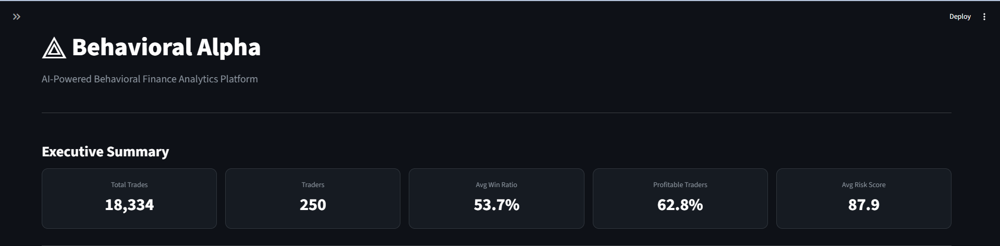
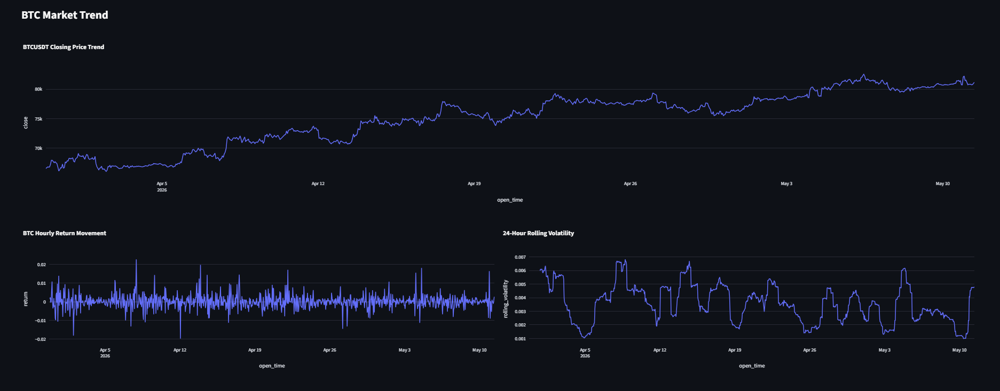
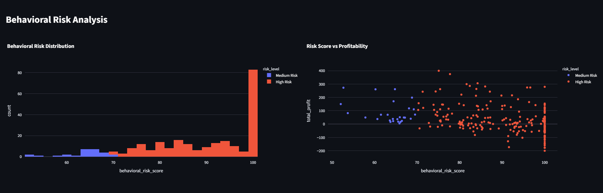
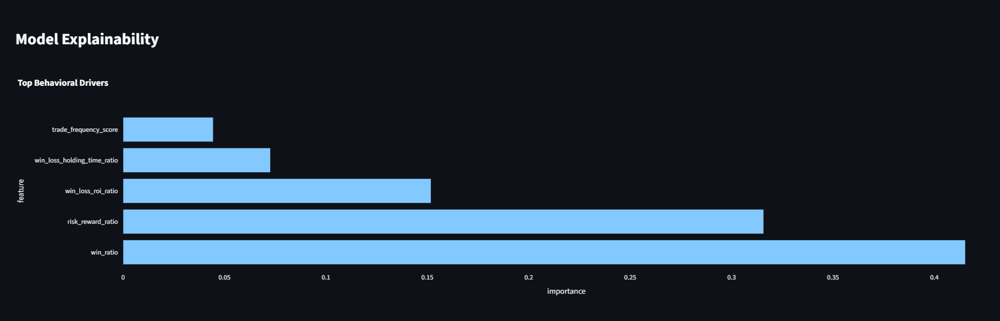

# ⟁ Behavioral Alpha

## AI-Powered Behavioral Finance Analytics Platform

Behavioral Alpha is an AI-powered behavioral finance analytics platform that quantifies trader psychology, risk discipline, profitability quality, and behavioral fragility using machine learning, portfolio analytics, simulated trader personas, and real Binance BTC market data.

---

# Dashboard Preview

## Executive Analytics Dashboard



## BTC Market Trend & Candlestick View



## Behavioral Risk Analysis



## Model Explainability



---

# Why this project matters

Traditional trading dashboards focus mostly on profit and loss.

Behavioral Alpha asks a deeper question:

> How did the trader make or lose money, and is that behavior sustainable?

The platform combines:

* behavioral finance
* quantitative analytics
* machine learning
* portfolio risk analysis
* explainable AI
* real BTC market movement

to evaluate the quality and sustainability of trading behavior.

---

# Core Features

* Real Binance BTCUSDT market data ingestion
* Trader persona simulation on real market movement
* Behavioral finance metrics engine
* Behavioral Risk Score
* Behavioral Alpha Score
* Portfolio analytics
* Random Forest profitability prediction model
* Model explainability with feature importance
* Interactive Streamlit dashboard
* BTC trend analysis
* BTC candlestick visualization
* Rolling volatility analysis
* Trader-risk visualization

---

# Trader Personas

Behavioral Alpha simulates multiple psychologically realistic trader personas:

## 1. Disciplined Trader

* balanced risk management
* rational exits
* stable risk-reward profile

## 2. Loss-Averse Trader

* holds losing trades too long
* exits profitable trades too quickly
* avoids realizing losses

## 3. Revenge Trader

* increases risk after losses
* emotionally overtrades
* elevated volatility exposure

## 4. Greedy Trader

* holds winning trades excessively long
* delays exits seeking unrealistic profits

## 5. Random Trader

* inconsistent behavior
* unstable execution patterns

---

# Behavioral Metrics Engine

The project calculates:

* Win Ratio
* Risk-Reward Ratio
* Win-Loss ROI Ratio
* Win-Loss Holding Time Ratio
* Trade Frequency Score
* Behavioral Alpha Score
* Behavioral Risk Score
* Sharpe Ratio
* Sortino Ratio
* Maximum Drawdown

---

# Behavioral Risk Score

The Behavioral Risk Score measures psychological instability and unsustainable trading behavior.

| Score Range | Interpretation         |
| ----------- | ---------------------- |
| 0–40        | Low Behavioral Risk    |
| 40–70       | Medium Behavioral Risk |
| 70–100      | High Behavioral Risk   |

A high score does not necessarily mean a trader is currently losing money.

It means the trader demonstrates behaviors associated with:

* emotional trading
* poor risk discipline
* unstable long-term outcomes
* fragile profitability

---

# Machine Learning Layer

Behavioral Alpha uses a Random Forest Classification model to predict whether a trader is likely to be profitable.

## Features Used

* Win Ratio
* Risk-Reward Ratio
* Win-Loss ROI Ratio
* Holding-Time Ratio
* Trading Frequency

## Example Model Performance

* Accuracy: 87.3%
* Precision: 92.1%
* Recall: 87.5%
* F1 Score: 89.7%

---

# Run Locally

## Install dependencies

```bash
pip install -r requirements.txt
```

## Run the full pipeline

```bash
python main.py
```

## Launch dashboard

```bash
python -m streamlit run app/streamlit_app.py
```

---

# Refresh Binance Data

```bash
python src/binance_data.py
python src/simulate_traders.py
python main.py
```

---

# Project Structure

```text
behavioral-alpha/
├── app/
│   └── streamlit_app.py
│
├── src/
│   ├── binance_data.py
│   ├── simulate_traders.py
│   ├── metrics.py
│   ├── model.py
│   ├── explainability.py
│   ├── portfolio_metrics.py
│   └── data_cleaning.py
│
├── data/
│   ├── raw/
│   └── processed/
│
├── assets/
│
├── main.py
├── requirements.txt
├── README.md
└── .gitignore
```

---

# Built With

* Python
* Pandas
* NumPy
* Scikit-learn
* Streamlit
* Plotly
* Binance API

---

# Future Roadmap

* SHAP explainability
* XGBoost benchmarking
* Live Binance streaming
* PostgreSQL integration
* FastAPI backend
* Reinforcement learning traders
* Network graph analytics
* Power BI executive dashboard
* Cloud deployment

---

# Author

## Ammar Jubril

Technology Consultant @ KPMG Nigeria | Data | AI | Quantitative Analytics

* MSc Financial Engineering Candidate

## Connect With Me

* LinkedIn: https://www.linkedin.com/in/ammarjubril
* GitHub: https://github.com/Jubril-Olasunkanmi

---

# License

MIT License
